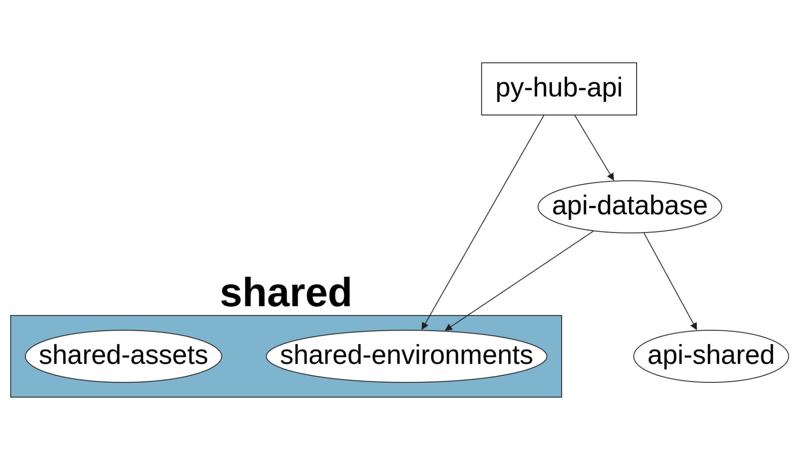

# Basic Workspace for New Projects

## deep graph
.
#### rodando os projetos

```
 nx serve starter-api
 nx serve starter-app
```

#### como rodar a API e APP simultaneamente

`npx nx run-many --target=serve --projects=starter-app,starter-api --parallel=true`

#### Dependencias

```
npx create-nx-workspace of5
npm install -g @nrwl/schematics
npm install -g nx
npm install -D @nrwl/angular
npm install --save-dev @angular-devkit/architect
npm install -D @nrwl/nest
```

#### criando aplicação Angular

```
npx nx generate @nrwl/angular:app starter-app
```

#### criando uma library Angular

```
nx g @nrwl/angular:library app-shared
```

#### criando aplicação NestJS

```
npx nx generate @nrwl/nest:application starter-api
```

#### criando uma library NestJS

```
nx generate @nrwl/nest:library api-shared
```

If you're using VS Code it may be necessary at this point to restart the TS server so that the new @myorg/data package is recognised. This may need to be done every time a new workspace library is added.

#### bom guia para NX

https://duncanhunter.gitbook.io/enterprise-angular-applications-with-ngrx-and-nx/introduction/3-generating-components-and-nx-lib

#### sobre o uso do git e commits

https://levelup.gitconnected.com/git-prettier-commits-with-husky-e5bcf2da4dac https://github.com/conventional-changelog/commitlint/tree/master/%40commitlint/config-conventional#type-enum https://dev.to/bhargavmantha/the-secret-to-configuring-eslint-prettier-prettier-eslint-plugin-in-vscode-for-angular-ts-and-js-project-51la https://beeman.dev/posts/set-up-and-configure-a-new-nx-workspace-1oh6/

#### configurando shareds para todos os projetos

https://indepth.dev/posts/1185/tiny-angular-application-projects-in-nx-workspaces

#### nada passará

```
nx format:write --all
```
